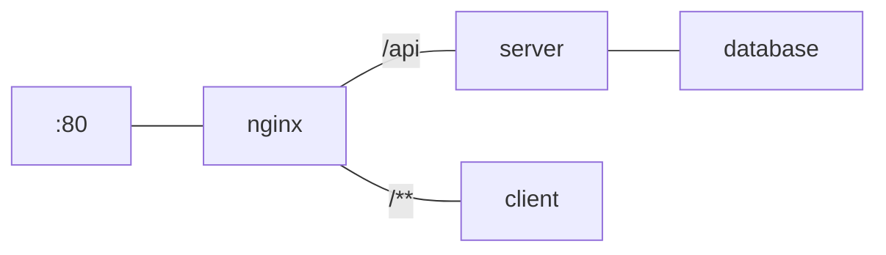
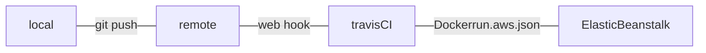

# 1. Blog-project
just blog

# 2. structure

```mermaid
graph RL
  database --- server
  server --/api--- nginx
  client --/**--- nginx
  nginx --- :80
```

# 3. deployment process

```mermaid
graph LR
  local --git push--- remote
  remote --web hook--- travisCI
  travisCI --Dockerrun.aws.json--- ElasticBeanstalk
```